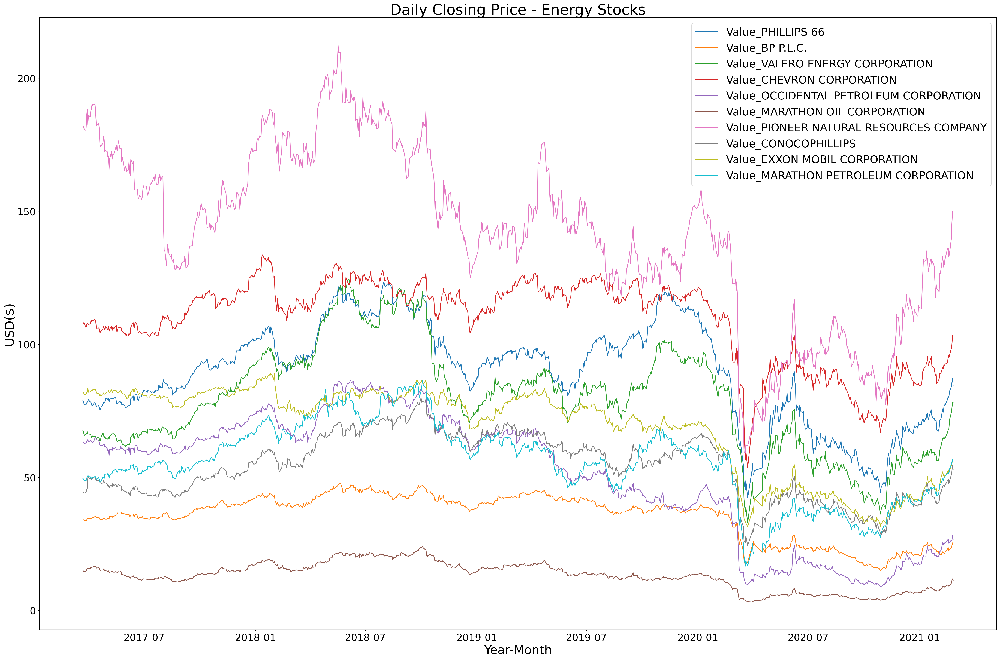
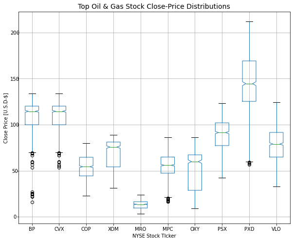
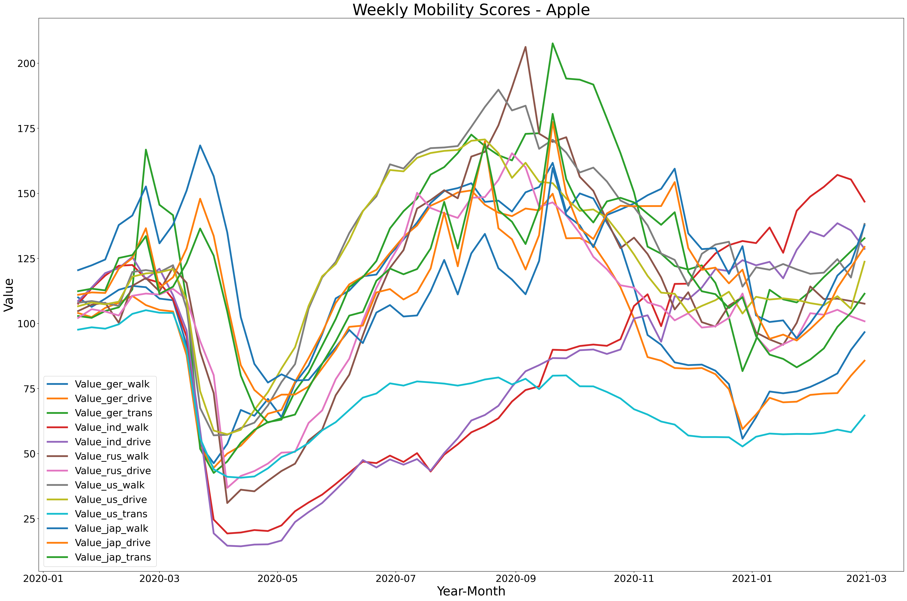
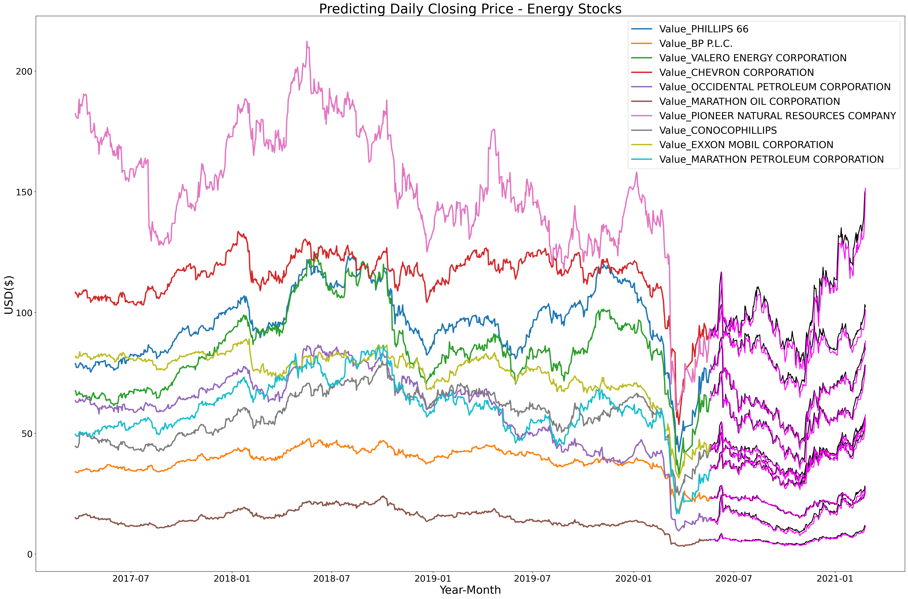

# Hackathon-March-2021
#### RMDS 2021 Data Science Competition - Impact of News Sentiment on the Stock Market

[External Resources](#acknowledgements_and_contact)

---
### Problem Statement:
> "This data science competition seeks to create an innovative solution to analyze the effects of news sentiment and biases on daily stock performance for top companies in the oil and gas industry. News Sentiments and biases have a significant impact on stock prices and consumer behavior. Contestants will be provided with the necessary news data, stock market data, macro data and company financial data." - [*RMDS Competition Website*](https://grmds.org/competition/news-sentiment)

---
### Table of Contents

* [Data Cleaning & EDA](#eda_and_cleaning)
    * [Data Dictionary](#appendix)
* [Production Model & Insights](#production_model_and_insights)
* [Recommendations and Next Steps](#recommendations_and_next_steps)
* [Acknowledgements and Contacts](#acknowledgements_and_contact)

---
## Data Cleaning & EDA

* [Data Dictionary](#appendix)

**Financial Trends**  

This graph shows four years of NYSE closing prices (2017-2021) for each of our ten target companies. The volatility is obvious, especially in the past year as the pandemic triggered a huge dip in March 2020. Interestingly, some companies appear to suffer from higher volatility than others. Here's a second visualization of the same data:  
  

We see that Marathon Oil ("MRO") in the center has a low price but also stays very close to its median value over time, neither rising nor falling to any great degree. In contrast, Pioneer Natural Resource Company (PXD) takes on a vast range of closing prices, suggesting it can make or break the risk-loving investor. BP and Chevron (CVX) appear to hold the highest median value but also suffer some peaks and valleys over time.

**Mobility Data**  
Apple  

This is a graph of the Apple mobility data - it was recorded in daily increments but for this graph it has been resampled at a weekly rate to provide a clearer trend picture. The countries whose scores were analyzed (USA, India, Russia, Japan, Germany) correspond to the top fossil fuel using countries with the exception of China for which no scores were available. The countries scores are further broken down into the categories of driving, walking, and transit, however there were no transit scores in the data for Russia and India. This led to a total of 13 Apple mobility features (USA:3, India:2, Russia:2, Japan:3, Germany:3). While this line graph undertakes a vaguely similar shape to the stock prices over the same time period, it did not prove to be particularly helpful with modeling and in fact brought down RMSE on the OLS model. Even more significantly, this dataset begins in early 2020, giving us little more than a year (~240 rows of business days) to analyze if we wanted to include it as a feature. Without it, we were able to include about four times as many rows using closing prices, sentiment, and indexes going back to early 2017.

**News Sentiment**

WorldData.ai provides an impressive array of news archives and sentiment scoring. Every article is analyzed through Natural Language Processing on a scale of -1 to 1 where anything above zero would be generally positive and anything below zero has a negative tilt. The scores we used were calculated by WorldData.ai so we (fortunately) did not have to classify tens of thousands of articles ourselves! Two things we DID have control over were news source and keyword selection.

With regards to sources, we investigated both Global and Financial news. Examples of Global news would be "The Guardian", "CNN", "Nigerian Tribune", "Toronto Star", or "Newsweek". In contrast, Financial sources included outlets like "Reuters", "The Wall Street Journal", and "Economic Times". These sources had little to no overlap based on our results, giving us confidence that we were not victims of redundant research. We searched all of our keywords across both types of sources, including all features that returned at least 100 related articles.

For keyword selection, we created the distinction of "Direct" and "Indirect" to differentiate our terms. Direct keywords had a parallel and often synonymous relationship with the target variables, including words like "oil", "pipeline", "drilling", as well as several target companies like "Exxon", "Valero, and "Chevron". Indirect keywords, however, had a varied range of relationships to our target closing prices. These were words like "Solar", "Greenhouse", "Emissions", "Airline", "Vacation", and "Sanctions". Some of the Direct keywords did not return enough results from the Global news sources to be included (i.e., "Marathon Oil"), but all of the indirect keywords found enough traction among both types of sources to be included as features in our model.

[Back to Top](#back_to_top)

---
## Production Model & Insights
[Back to Top](#back_to_top)  
**OLS**  
The first model we developed was an ordinary least squares regression using the statsmodels package in Python. We used the NYSE closing prices as the base of the dataframe and then (left) joined all other features by matching dates. The mobility data, while thought provoking, only exists for roughly the past year, so it was disregarded in favor of a broader (4 year) look.

The measure of error (RMSE) was very good, indicating that the 10 close price predictions were within \\$0.65 to \\$4.47 of true values on average, as we might expect based on the consistent overlap between the black lines (test data) and purple lines (predicted close prices) in the image above. More importantly, however, a closer examination of the coefficients reveals which features were most critical to our predictions.  

|                                            |   Feature_count |
|:-------------------------------------------|----------------:|
| lag_d_f_oil                                |               8 |
| lag_d_f_marathon_oil                       |               7 |
| lag_d_f_phillips_66                        |               5 |
| const                                      |               5 |
| lag_i_f_carbon_footprint                   |               4 |
| lag_d_f_valero                             |               3 |
| lag_d_f_occidental_petroleum               |               3 |
| lag_d_f_fossil_fuel                        |               3 |
| lag_Value_CONOCOPHILLIPS                   |               1 |
| lag_Value_EXXON MOBIL CORPORATION          |               1 |
| lag_Value_OCCIDENTAL PETROLEUM CORPORATION |               1 |
| lag_i_g_hurricane_storm                    |               1 |
| lag_i_g_greenhouse                         |               1 |
| lag_Value_PHILLIPS 66                      |               1 |
| lag_d_f_chevron                            |               1 |
| lag_Value_BP P.L.C.                        |               1 |
| lag_d_g_oil                                |               1 |
| lag_i_f_solar                              |               1 |
| lag_Value_MARATHON OIL CORPORATION         |               1 |
| lag_Value_MARATHON PETROLEUM CORPORATION   |               1 |

This is an aggregate table of the 5 largest coefficients (by absolute value) for each of the ten target closing prices. Each feature is preceded by the word "lag" because it was lagged one day in order to simulate "yesterday's" news sentiment as a predictive factor for "today's" close price. We can see that the Direct keyword "oil" from the Financial News database was one of the top 5 most important features for 8 of the 10 targets! Second on the list is the Direct, Financial search phrase "marathon oil", followed by the Direct, Financial phrase "Phillips 66". Tied for third was the constant added to provide a y-intercept that is necessary in time-series modeling so not particularly valuable to us, however the next four most frequent are also news sentiment scores! We see the Indirect phrase "carbon footprint" from the Global News sources and then three more entries from the Direct, Financial news bucket, namely "valero", "occidental petroleum", and "fossil fuel". What is fascinating about this return is that the news sentiment scores, generally speaking, ranked higher in importance than the prior day's closing price for most stocks! This study suggests that news sentiment can be a powerful tool on the belt of any data scientist looking to create a more complete, multi-variate model predicting closing stock prices.

---
## Recommendations and Next Steps
[Back to Top](#back_to_top)  

Our results from careful examination and modeling give credence to the competition organizers' hypothesis that "News Sentiments and biases have a significant impact on stock prices and consumer behavior." 

---
## Acknowledgements and Contacts:
[Back to Top](#back_to_top)

### External Resources:

#### Official Competition Resources:
> * [`2021 Data Science Competition Overview`] (GRMDS Online): ([*source*](https://grmds.org/competition/news-sentiment))
> * [`Dataset Overview`] (WorldData.AI): ([*source*](https://worlddata.ai/bucket/WorldDataTeam/Competition_RMDS_WorldData))

#### Other Related Information:
> * [`Which Countries Use the Most Fossil Fuels?`] (Resource Watch): ([*source*](https://blog.resourcewatch.org/2019/05/02/which-countries-use-the-most-fossil-fuels/))
> * [`2020 Russia–Saudi Arabia Oil Price War`] (Wiki): ([*source*](https://en.wikipedia.org/wiki/2020_Russia%E2%80%93Saudi_Arabia_oil_price_war))
> * [`MobilityScore: an Improvement over TransitScore?`] (Blog: Human Transit): ([*source*](https://humantransit.org/2018/01/mobilityscore-an-improvement-over-transitscore.html))
> * [`Media Bias Fact Check`] (MBFC News): ([*source*](https://mediabiasfactcheck.com/2021/03/03/the-latest-fact-checks-curated-by-media-bias-fact-check-3-3-2021/))
> * [`JODI-Oil Data Downloads`] (JODI): ([*source*](https://www.jodidata.org/oil/database/data-downloads.aspx))
> * [`Stock Trading Strategy & Education: Open Interest`] (Investopedia): ([*source*](https://www.investopedia.com/terms/o/openinterest.asp))
> * [`West Texas Intermediate (WTI)`] (Investopedia): ([*source*](https://www.investopedia.com/terms/w/wti.asp))
> * [`Is the Stock Market Closed Today (Dec 5, 2018)? Why?`] (Heavy): ([*source*](https://heavy.com/news/2018/12/stock-market-closed-national-day-of-mourning/))

* [`Title`] (Platform): ([*source*](https://www.URL.com))

### Papers:
* `Valero Energy Corporation Case Study` (Journal of Advanced Research in Social Sciences and Humanities): ([*source*](https://jarssh.com/papers/volume5-issue1/JARSSH-05-2020-0105.pdf))

* `Title` (Journal/Blog): ([*source*](https://www.URL.com))

### Team Contacts:
##### Main Contributors
> * Brandon [GitHub](https://github.com/griffinbran) | [LinkedIn](https://www.linkedin.com/in/griffinbran/)
> * Will [GitHub](https://github.com/griffinwt) | [LinkedIn](https://www.linkedin.com/in/griffinwt)
##### Associates
> * Nader [GitHub](https://github.com/laternader) | [LinkedIn](https://www.linkedin.com/in/ncesmael)
> * Cloudy [GitHub](https://github.com/cloudmcloudyo) | [LinkedIn](https://www.linkedin.com/in/cloudyliu)
> * James [GitHub](https://github.com) | [LinkedIn](https://www.linkedin.com/in/jamessalisbury)
> * Cristina [GitHub](https://github.com/CristinaSahoo) | [LinkedIn](https://www.linkedin.com/in/cristinasahoo)

---
## Appendix: Data Dictionary

[Back to Top](#back_to_top)

|Indicator|Data Type|Dataset|Region-Frequency|Description|
|---|---|---|---|---|
|**Brent Crude Oil**|*float*|Commodity Prices|Daily|Price, in USD per barrel, of North Sea Brent crude oil as traded on the Intercontinental Exchange(ICE).|
|**WTI Crude Oil**|*float*|Commodity Prices|Daily|Price, in USD per barrel, of West Texas Intermediate(WTI) crude oil, the underlying commodity of the NYMSEX. It is the main oil benchmark for North America.|
|**Settlement Price**|*float*|Commodity & Exchange|Daily|Price of final transaction on a futures exchange for a given "trading" day.|
|**Open Interest**|*int*|Commodity & Exchange|Daily|Number of outstanding contracts(positions held) in the derivatives market. Open interest is an indicator of liquidity as each futures contract is for 100 shares.|
|**Grocery & Pharmacy**|*float*|Google Mobility|U.S. Daily|Mobility trends for places like grocery markets, food warehouses, farmers markets, specialty food shops, drug stores, and pharmacies.|
|**Parks**|*float*|Google Mobility|U.S. Daily|Mobility trends for places like local parks, national parks, public beaches, marinas, dog parks, plazas, and public gardens.|
|**Transit Stations**|*float*|Google Mobility|U.S. Daily|Mobility trends for places like public transport hubs such as subway, bus, and train stations.|
|**Retail & Recreation**|*float*|Google Mobility|U.S. Daily|Mobility trends for places like restaurants, cafes, shopping centers, theme parks, museums, libraries, and movie theaters.|
|**Residential**|*float*|Google Mobility|U.S. Daily|Mobility trends for places of residence.|
|**Workplaces**|*float*|Google Mobility|U.S. Daily|Mobility trends for places of work.|
|**Value_(country)\_walk**|*float*|Apple Mobility|Various Nations Daily|Change from baseline (100) in requests for walking directions in given country; ger=Germany, ind = India, rus=Russia, us=USA, jap=Japan|
|**Value_(country)\_drive**|*float*|Apple Mobility|Various Nations Daily|Change from baseline (100) in requests for driving directions in given country; ger=Germany, ind = India, rus=Russia, us=USA, jap=Japan|
|**Value_(country)\_trans**|*float*|Apple Mobility|Various Nations Daily|Change from baseline (100) in requests for transit routing in given country (not available for Russia or India); ger=Germany, us=USA, jap=Japan|
|**d\_f\_(keyword)**|*float*|News Sentiment Score|Worldwide Daily|Daily News Sentiment score from Financial News sources related to Direct keywords: chevron, drilling, exxon, fossil_fuel, marathon_oil, occidental_petroleum, oil, oilfield, phillips_66, pipeline, valero|
|**d\_g\_(keyword)**|*float*|News Sentiment Score|Worldwide Daily|Daily News Sentiment score from Global News sources related to Direct keywords: chevron, drilling, exxon, fossil_fuel, oil, oilfield, pipeline, valero|
|**i\_f\_(keyword)**|*float*|News Sentiment Score|Worldwide Daily|Daily News Sentiment score from Financial News sources related to Indirect keywords: airline, carbon_footprint, emissions, epa, greenhouse, hurricane_storm, pollution, sanction, solar, turbine, vacation|    
|**i\_g\_(keyword)**|*float*|News Sentiment Score|Worldwide Daily|Daily News Sentiment score from Global News sources related to Indirect keywords: airline, carbon_footprint, emissions, epa, greenhouse, hurricane_storm, pollution, sanction, solar, turbine, vacation|
 |**Value_(company)**|*float*|Closing Price|NYSE Daily|Daily close price for given company, used as target (y value) for modeling - companies: phillips_66, bp_plc, valero_energy_corporation, chevron_corporation, occidental_petroleum_corporation, marathon_oil_corporation, pioneer_natural_resources_company, conocophillips, exxon_mobil_corporation, marathon_petroleum_corporation|
|**dow_jones_transportation_average**|*float*|Stock Market Index|U.S. Daily|"The Dow Jones Transportation Average (DJTA, also called the "Dow Jones Transports") is a U.S. stock market index from S&P Dow Jones Indices of the transportation sector, and is the most widely recognized gauge of the American transportation sector."[Wikipedia](https://en.wikipedia.org/wiki/Dow_Jones_Transportation_Average)|
|**dow_jones_composite_average**|*float*|Stock Market Index|U.S. Daily|"The Dow Jones Composite Average is a stock index from Dow Jones Indexes that tracks 65 prominent companies. The average's components include every stock from the Dow Jones Industrial Average (30 components), the Dow Jones Transportation Average (20), and the Dow Jones Utility Average (15)."[Wikipedia](https://en.wikipedia.org/wiki/Dow_Jones_Composite_Average)|
|**dow_jones_industrial_average**|*float*|Stock Market Index|U.S. Daily|"The Dow Jones Industrial Average (DJIA), Dow Jones, or simply the Dow (/ˈdaʊ/), is a stock market index that measures the stock performance of 30 large companies listed on stock exchanges in the United States."[Wikipedia](https://en.wikipedia.org/wiki/Dow_Jones_Industrial_Average)|
|**dow_jones_utility_average**|*float*|Stock Market Index|U.S. Daily|"The Dow Jones Utility Average (DJUA, also known as the "Dow Jones Utilities") is a stock index from S&P Dow Jones Indices that tracks the performance of 15 prominent utility companies traded in the United States"[Wikipedia](https://en.wikipedia.org/wiki/Dow_Jones_Utility_Average)|
|**s&p_500**|*float*|Stock Market Index|U.S. Daily|"The S&P 500, or simply the S&P, is a stock market index that measures the stock performance of 500 large companies listed on stock exchanges in the United States. It is one of the most commonly followed equity indices."[Wikipedia](https://en.wikipedia.org/wiki/S%26P_500)|

[Back to Top](#back_to_top)

---